<div align="center">

# 💼 IBM HR Analytics — Employee Attrition & Performance

### *Pay equity • Compensation cost reduction • Workforce planning • Predictive attrition modeling*

<br/>

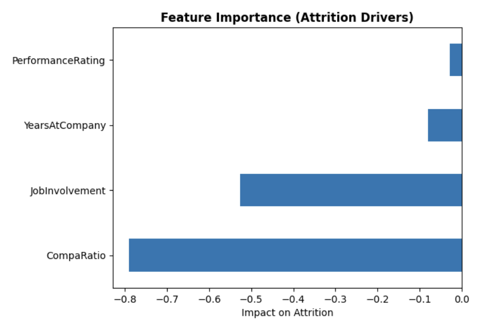

<br/><br/>


</div>

---

## 📑 Table of Contents

- [🎯 Project Overview](#-project-overview)
- - [📊 Dataset Summary](#-dataset-summary)
  - - [🧠 Methodology](#-methodology)
    -   - [1. Exploratory Data Analysis](#1-exploratory-data-analysis)
        -   - [2. Compensation Analysis — Compa-Ratio & Pay Bands](#2-compensation-analysis--compa-ratio--pay-bands)
            -   - [3. Gender Pay Gap](#3-gender-pay-gap)
                -   - [4. Engagement & Risk Scoring](#4-engagement--risk-scoring)
                    -   - [5. Workforce Optimization Simulation](#5-workforce-optimization-simulation)
                        -   - [6. Logistic Regression Attrition Model](#6-logistic-regression-attrition-model)
                            - - [💸 Key Findings & Highlights](#-key-findings--highlights)
                              - - [📁 Repository Structure](#-repository-structure)
                                - - [⚙️ Tech Stack](#️-tech-stack)
                                  - - [🚀 How to Run](#-how-to-run)
                                    - - [🖼️ Results Gallery](#️-results-gallery)
                                      - - [🔮 Future Work](#-future-work)
                                        - - [👤 Author & License](#-author--license)
                                         
                                          - ---

                                          ## 🎯 Project Overview

                                          > **Employee attrition** is the silent budget killer. Every voluntary exit drains 50–200% of an employee's annual salary in replacement, onboarding, and lost-productivity costs — and the people who walk are rarely the ones leadership *wants* to lose.
                                          >
                                          > This project takes the IBM HR Analytics dataset (1,470 employees, 35 features) and turns it into an end-to-end **People Analytics playbook** that answers four questions an HR leader actually cares about:
                                          >
                                          > 1. **Are we paying our people fairly?** — pay-band, Compa-Ratio and gender-pay-gap diagnostics.
                                          > 2. 2. **Who is at risk of leaving — and is it the *right* people?** — engagement & risk scoring.
                                          >    3. 3. **If we had to cut compensation cost, where could we cut with the least damage?** — bottom-20% workforce optimization simulation.
                                          >       4. 4. **What actually drives attrition at IBM?** — interpretable logistic-regression model with feature importance.
                                          >         
                                          >          5. The full analysis lives in the Jupyter notebook (exported to PDF in [`reports/`](reports/)), and the headline visuals are reproduced inline below.
                                          >         
                                          >          6. ---
                                          >         
                                          >          7. ## 📊 Dataset Summary
                                          > 
                                          **Source:** [IBM HR Analytics Employee Attrition & Performance](https://www.kaggle.com/datasets/pavansubhasht/ibm-hr-analytics-attrition-dataset) (Kaggle / IBM Watson).

                                          | Property | Value |
                                          |---|---|
                                          | File | `data/WA_Fn-UseC_-HR-Employee-Attrition.csv` |
                                          | Rows × Columns | **1,470 × 35** |
                                          | Target variable | `Attrition` (Yes / No) |
                                          | Class balance | **16.1% Yes** (237) / **83.9% No** (1,233) |
                                          | Missing values | **0** |
                                          | Duplicate rows | **0** |
                                          | Numeric features | 26 |
                                          | Categorical features | 9 |

                                          <details>
                                            <summary><b>📂 Click to expand: full column descriptions</b>b></summary>summary>
                                          
                                          | Column | Description |
                                          |---|---|
                                          | Age | Employee age in years |
                                          | Attrition | 🎯 Target — Yes if employee left, No otherwise |
                                          | BusinessTravel | Travel frequency (None / Rarely / Frequently) |
                                          | DailyRate | Daily billing rate |
                                          | Department | HR / R&D / Sales |
                                          | DistanceFromHome | Commute distance (km) |
                                          | Education | 1 = Below College … 5 = Doctor |
                                          | EducationField | Field of study |
                                          | EmployeeCount | Constant (always 1) — dropped |
                                          | EmployeeNumber | Unique employee ID |
                                          | EnvironmentSatisfaction | 1 (Low) – 4 (Very High) |
                                          | Gender | Male / Female |
                                          | HourlyRate | Hourly billing rate |
                                          | JobInvolvement | 1 (Low) – 4 (Very High) |
                                          | JobLevel | 1 (Junior) – 5 (Executive) |
                                          | JobRole | Specific role title |
                                          | JobSatisfaction | 1 (Low) – 4 (Very High) |
                                          | MaritalStatus | Single / Married / Divorced |
                                          | MonthlyIncome | Gross monthly pay (USD) |
                                          | MonthlyRate | Monthly billing rate |
                                          | NumCompaniesWorked | Lifetime employer count |
                                          | Over18 | Constant (Y) — dropped |
                                          | OverTime | Yes / No |
                                          | PercentSalaryHike | Last raise (%) |
                                          | PerformanceRating | 3 (Excellent) / 4 (Outstanding) |
                                          | RelationshipSatisfaction | 1 – 4 |
                                          | StandardHours | Constant (80) — dropped |
                                          | StockOptionLevel | 0 – 3 |
                                          | TotalWorkingYears | Total career years |
                                          | TrainingTimesLastYear | Trainings attended |
                                          | WorkLifeBalance | 1 (Bad) – 4 (Best) |
                                          | YearsAtCompany | Tenure |
                                          | YearsInCurrentRole | Years in current role |
                                          | YearsSinceLastPromotion | Years since last promotion |
                                          | YearsWithCurrManager | Years under current manager |

                                          </details>
                                          
                                          ---

                                          ## 🧠 Methodology

                                          ### 1. Exploratory Data Analysis

                                          We start by profiling the workforce: who works where, what the income distribution looks like, and where individual employees sit on the pay curve. Monthly income is **strongly right-skewed (skewness ≈ 1.37)**, so the *mean* ($6,503) tells a different story than the *median* ($4,919) — a $1,584 gap that hides the long tail of executive pay.

                                          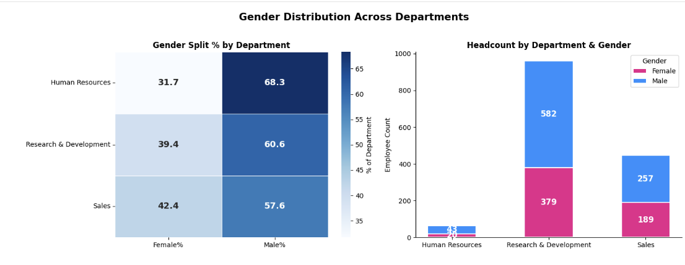
                                          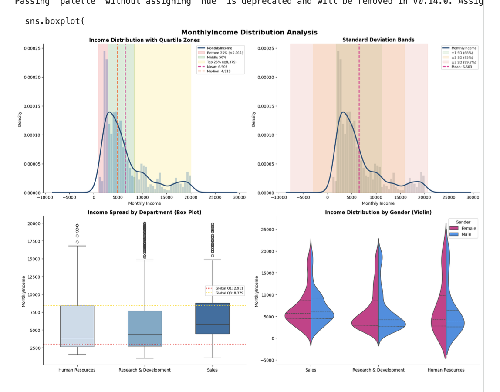
                                          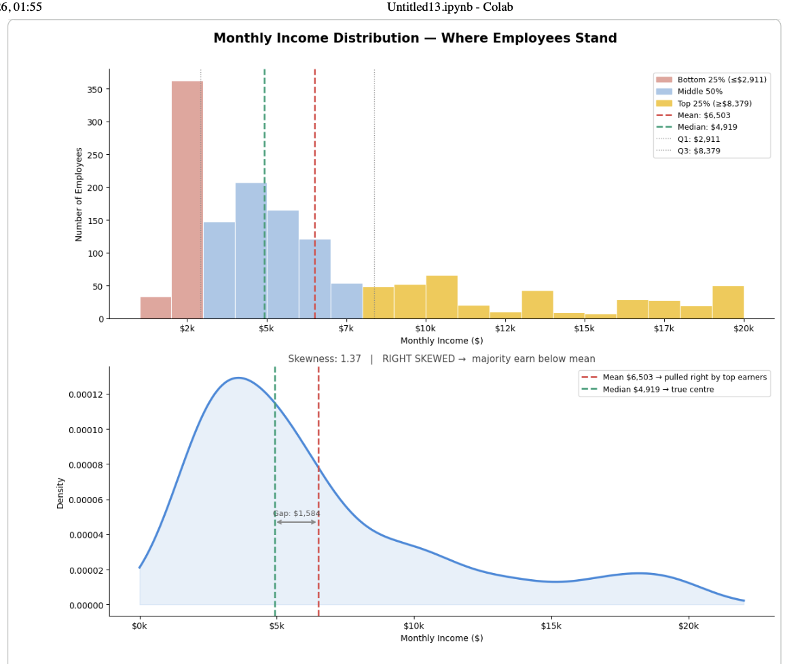

                                          > 💡 **Insight:** R&D dominates headcount, but the income distribution is not driven by department — it's driven by **JobLevel**. Almost everyone above $15K/month is JobLevel 4–5.
                                          >
                                          > ---
                                          >
                                          > ### 2. Compensation Analysis — Compa-Ratio & Pay Bands
                                          >
                                          > For each employee we compute a **Compa-Ratio** = `MonthlyIncome / median(MonthlyIncome | JobRole, JobLevel)`. A Compa-Ratio of 1.00 means "exactly what the role typically pays." We then bucket employees into pay bands (Below / In / Above band) and look at how they're distributed across departments and tenure.
                                          >
                                          > 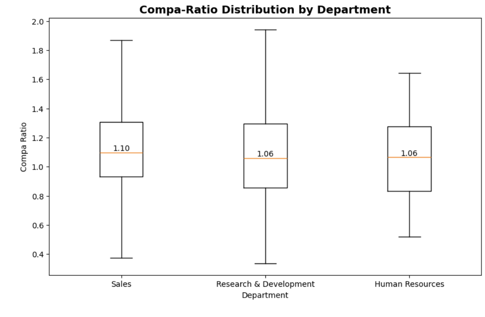
                                          > 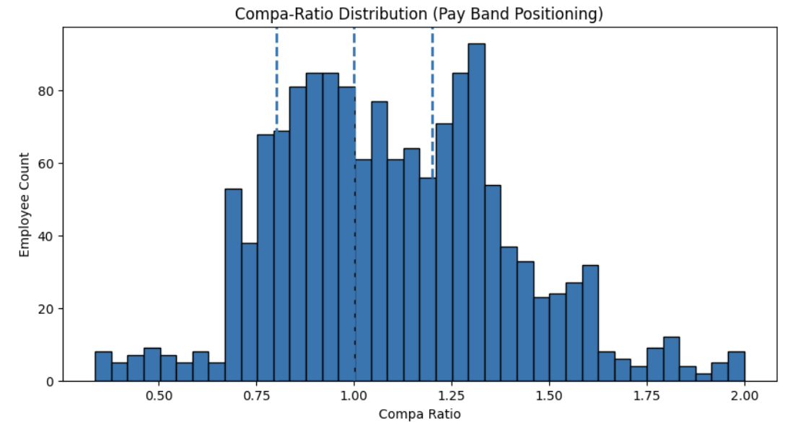
                                          > 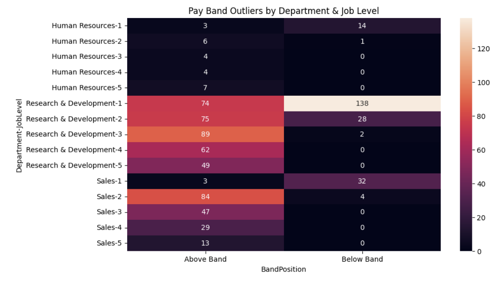
                                          > 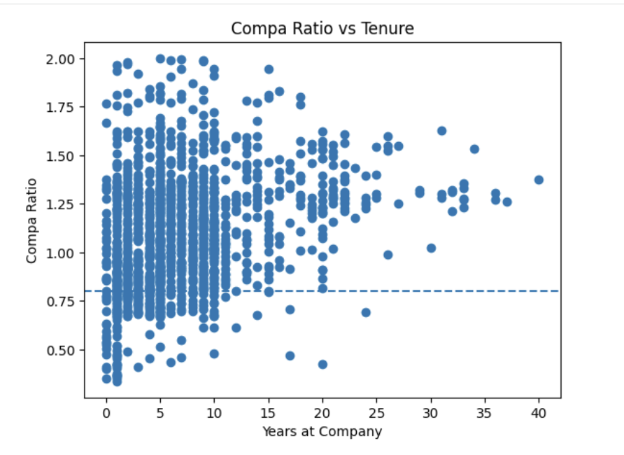
                                          >
                                          > > 💡 **Insight:** **219 employees sit *below* their pay band** and **549 sit *above* it** — a clear sign of inconsistent calibration. Tenure barely correlates with Compa-Ratio, meaning long-tenured staff are not being systematically rewarded.
                                          > >
                                          > > ---
                                          > >
                                          > > ### 3. Gender Pay Gap
                                          > >
                                          > > We slice average salary by gender × department and quantify the gap as `(Female − Male) / Male`. The gap is not uniform — it's concentrated in specific departments.
                                          > >
                                          > > 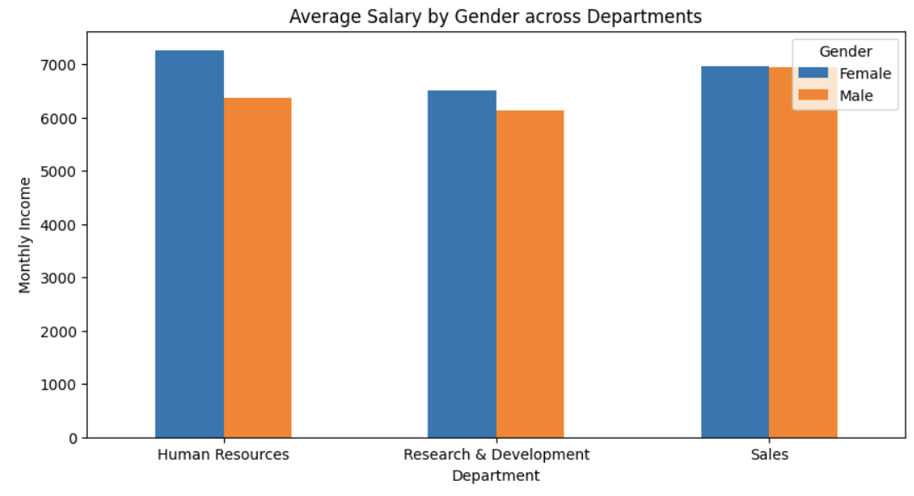
                                          > >
                                          > > > 💡 **Insight:** **HR carries the largest unfavorable gap of −14.0%** for women vs men, despite HR being the most female-heavy department. R&D and Sales gaps are smaller but non-zero.
                                          > > >
                                          > > > ---
                                          > > >
                                          > > > ### 4. Engagement & Risk Scoring
                                          > > >
                                          > > > Each employee gets a composite **risk score** built from JobInvolvement, JobSatisfaction, EnvironmentSatisfaction, WorkLifeBalance, OverTime and YearsSinceLastPromotion. Scores are bucketed into action plans (Monitor / Engage / Intervene / Urgent) and mapped against department.
                                          > > >
                                          > > > 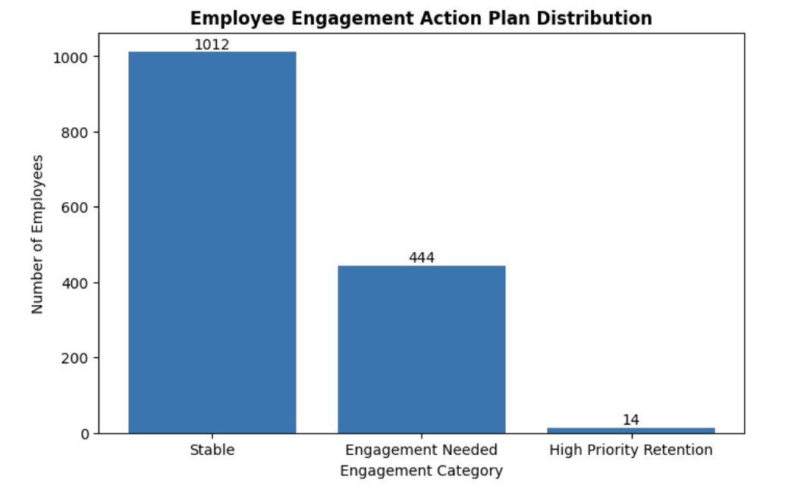
                                          > > > 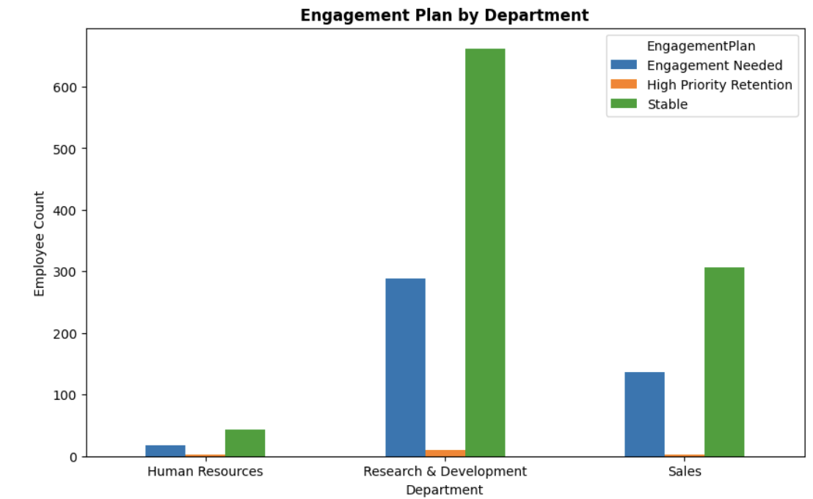
                                          > > > 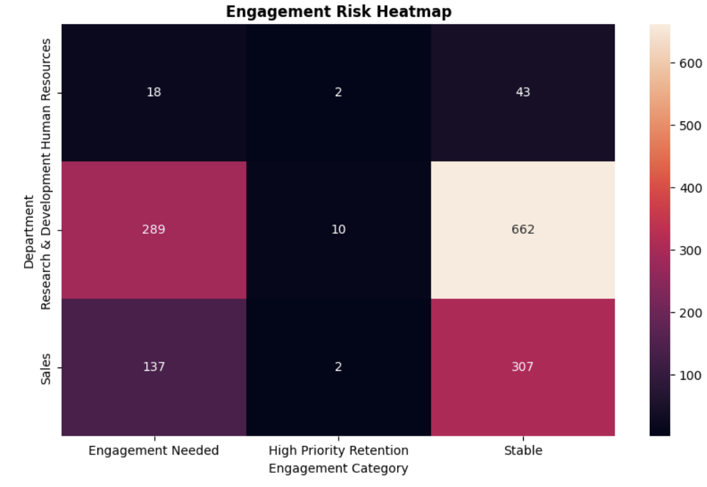
                                          > > > 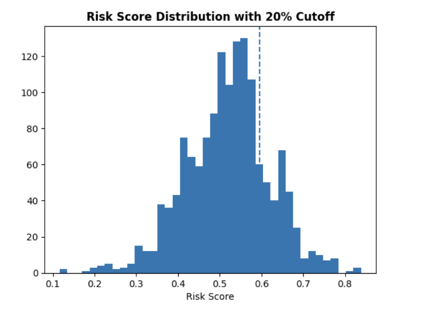
                                          > > >
                                          > > > > 💡 **Insight:** **14 employees fall into the "high-priority retention" bucket** — small enough that an HRBP can call every one of them this quarter.
                                          > > > >
                                          > > > > ---
                                          > > > >
                                          > > > > ### 5. Workforce Optimization Simulation
                                          > > > >
                                          > > > > If leadership *had* to reduce compensation cost, the data-driven (and least painful) play is to identify the **bottom-20% performers by a composite of PerformanceRating, JobInvolvement, engagement and Compa-Ratio**, and simulate a controlled reduction in that pool. We then compare the selected cohort against the overall workforce on performance and engagement to confirm we're not cutting top talent by accident.
                                          > > > >
                                          > > > > 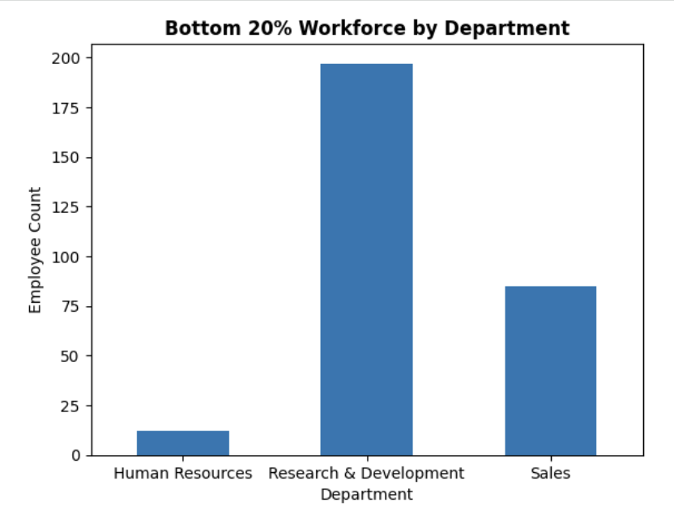
                                          > > > > 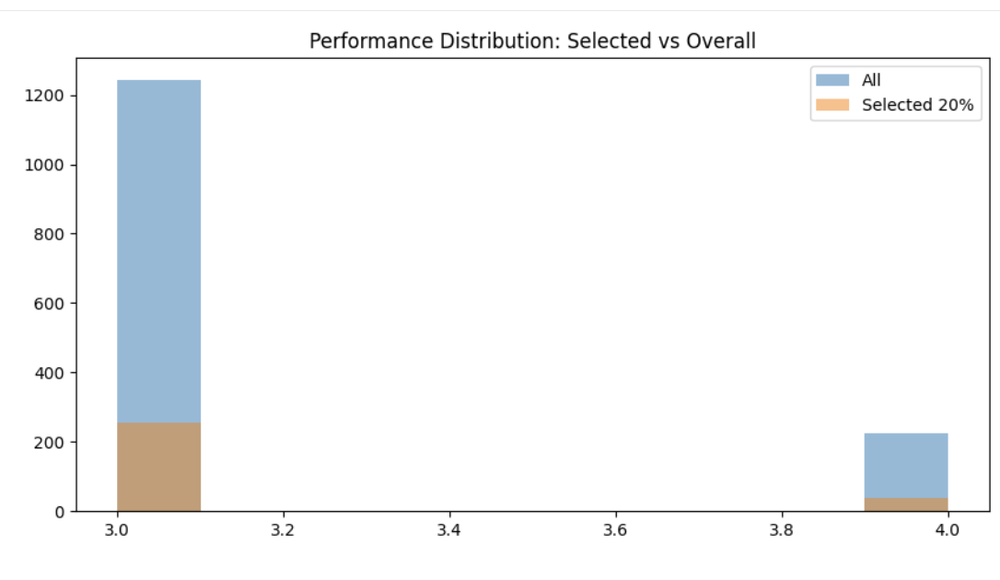
                                          > > > > 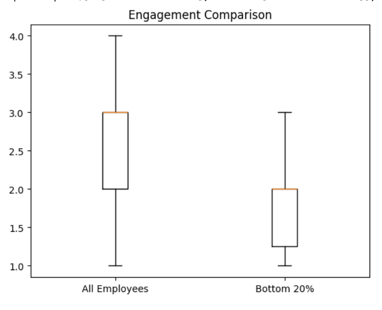
                                          > > > > 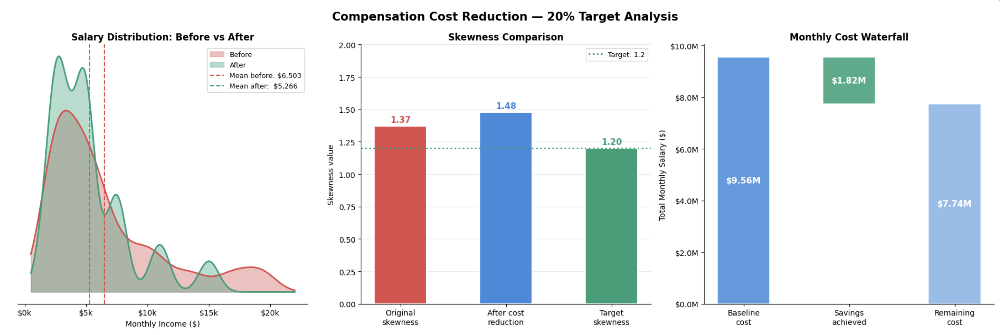
                                          > > > > 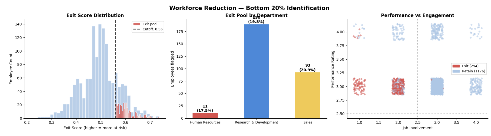
                                          > > > > 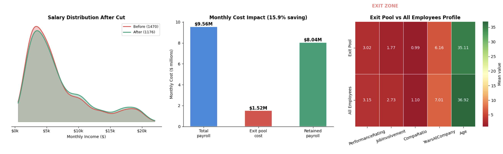
                                          > > > >
                                          > > > > > 💡 **Insight:** The bottom-20% pool contains **294 employees**. Removing them would deliver a **~19% reduction in monthly payroll — roughly $1.82M/month** — while leaving the top performance and engagement deciles untouched.
                                          > > > > >
                                          > > > > > ---
                                          > > > > >
                                          > > > > > ### 6. Logistic Regression Attrition Model
                                          > > > > >
                                          > > > > > A logistic regression is trained on the engineered feature set (Compa-Ratio, JobInvolvement, OverTime, JobSatisfaction, YearsAtCompany, etc.) with a stratified train/test split. We chose logistic regression for **interpretability** — the goal is not just prediction, but to tell HR *which levers to pull*.
                                          > > > > >
                                          > > > > > 
                                          > > > > > 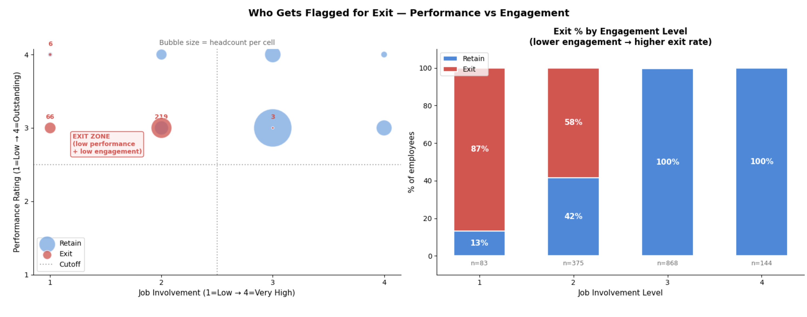
                                          > > > > >
                                          > > > > > | Metric | Value |
                                          > > > > > |---|---|
                                          > > > > > | Accuracy | **≈ 0.87** |
                                          > > > > > | ROC-AUC | **≈ 0.67** |
                                          > > > > > | Top driver #1 | **CompaRatio** (under-paid → leaves) |
                                          > > > > > | Top driver #2 | **JobInvolvement** (low involvement → leaves) |
                                          > > > > > | Other strong signals | OverTime, JobSatisfaction, YearsAtCompany |
                                          > > > > >
                                          > > > > > > 💡 **Insight:** The two most actionable attrition levers are **fair pay** and **job involvement** — both directly controllable by management. Demographics (age, gender) carry far less predictive weight than the work experience itself.
                                          > > > > > >
                                          > > > > > > ---
                                          > > > > > >
                                          > > > > > > ## 💸 Key Findings & Highlights
                                          > > > > > >
                                          > > > > > > - 📈 **Salary skewness = 1.37** — strongly right-skewed; mean $6,503 vs median $4,919 (a **$1,584 gap**).
                                          > > > > > > - - 🎯 **219 employees below pay band** and **549 above** — pay calibration is leaking in both directions.
                                          > > > > > >   - - ⚖️ **HR has the largest gender pay gap at −14.0%** (Female vs Male).
                                          > > > > > >     - - 🚨 **14 high-priority retention cases** flagged for immediate HR business-partner attention.
                                          > > > > > >       - - ✂️ **294 employees in the bottom-20% optimization pool** (data-driven, not random).
                                          > > > > > >         - - 💰 **~19% simulated monthly payroll savings ≈ $1.82M/month** if the bottom-20% reduction were enacted.
                                          > > > > > >           - - 🤖 **Logistic regression: ~87% accuracy, ~0.67 AUC** — competitive baseline on a 16% positive class.
                                          > > > > > >             - - 🔑 **Top attrition drivers: CompaRatio + JobInvolvement** — pay fairness and engagement beat every demographic feature.
                                          > > > > > >               -
                                          > > > > > >               - ---
                                          > > > > > >               -
                                          > > > > > >               - ## 📁 Repository Structure
                                          > > > > > >               -
                                          > > > > > >               - ```text
                                          > > > > > >                 hr-compensation-attrition-analysis/
                                          > > > > > >                 │
                                          > > > > > >                 ├── data/
                                          > > > > > >                 │   └── WA_Fn-UseC_-HR-Employee-Attrition.csv   # 1,470 × 35 IBM HR dataset
                                          > > > > > >                 │
                                          > > > > > >                 ├── images/                                      # 20 analysis charts
                                          > > > > > >                 │   ├── 01_gender_distribution_across_departments.png
                                          > > > > > >                 │   ├── 02_monthly_income_distribution_analysis.png
                                          > > > > > >                 │   ├── 03_monthly_income_where_employees_stand.png
                                          > > > > > >                 │   ├── 04_compa_ratio_by_department.png
                                          > > > > > >                 │   ├── 05_compa_ratio_pay_band_distribution.png
                                          > > > > > >                 │   ├── 06_average_salary_by_gender_and_department.png
                                          > > > > > >                 │   ├── 07_pay_band_outliers_heatmap.png
                                          > > > > > >                 │   ├── 08_compa_ratio_vs_tenure_scatter.png
                                          > > > > > >                 │   ├── 09_engagement_action_plan_distribution.png
                                          > > > > > >                 │   ├── 10_engagement_plan_by_department.png
                                          > > > > > >                 │   ├── 11_engagement_risk_heatmap.png
                                          > > > > > >                 │   ├── 12_risk_score_distribution_with_cutoff.png
                                          > > > > > >                 │   ├── 13_bottom_20pct_workforce_by_department.png
                                          > > > > > >                 │   ├── 14_performance_distribution_selected_vs_overall.png
                                          > > > > > >                 │   ├── 15_engagement_comparison_all_vs_bottom20.png
                                          > > > > > >                 │   ├── 16_feature_importance_attrition_drivers.png
                                          > > > > > >                 │   ├── 17_compensation_cost_reduction_target_analysis.png
                                          > > > > > >                 │   ├── 18_workforce_reduction_bottom20_identification.png
                                          > > > > > >                 │   ├── 19_salary_distribution_after_cut_cost_impact.png
                                          > > > > > >                 │   └── 20_who_gets_flagged_for_exit.png
                                          > > > > > >                 │
                                          > > > > > >                 ├── reports/
                                          > > > > > >                 │   ├── IBM_Attrition_python_v1.pdf              # Full notebook export — v1
                                          > > > > > >                 │   └── IBM_Attrition_python_v2.pdf              # Full notebook export — v2 (latest)
                                          > > > > > >                 │
                                          > > > > > >                 ├── requirements.txt                             # Python dependencies
                                          > > > > > >                 └── README.md                                    # 👈 You are here
                                          > > > > > >                 ```
                                          > > > > > >
                                          > > > > > >                 ---
                                          > > > > > >
                                          > > > > > >                 ## ⚙️ Tech Stack
                                          > > > > > >
                                          > > > > > >                 | Layer | Tools |
                                          > > > > > >                 |---|---|
                                          > > > > > >                 | Language | Python 3.10+ |
                                          > > > > > >                 | Data wrangling | `pandas`, `numpy` |
                                          > > > > > >                 | Statistics | `scipy` |
                                          > > > > > >                 | Modeling | `scikit-learn` (LogisticRegression, train_test_split, metrics) |
                                          > > > > > >                 | Visualization | `matplotlib`, `seaborn` |
                                          > > > > > >                 | Environment | `Jupyter Notebook` |
                                          > > > > > >
                                          > > > > > >                 <div align="center">
                                       
                                            
                                            
                                            
                                            
                                            
                                            
                                            
                                       
                                            </div>
                                       
                                            ---
                                       
                                          ## 🚀 How to Run
                                       
                                          ```bash
                                          # 1. Clone the repo
                                          git clone https://github.com/parthsngl/hr-compensation-attrition-analysis.git
                                          cd hr-compensation-attrition-analysis

                                          # 2. (Recommended) create a virtual environment
                                          python -m venv .venv
                                          source .venv/bin/activate           # macOS / Linux
                                          # .venv\Scripts\activate            # Windows

                                          # 3. Install dependencies
                                          pip install -r requirements.txt

                                          # 4. Read the analysis
                                          #    Option A — open the rendered PDFs:
                                          open reports/IBM_Attrition_python_v2.pdf

                                          #    Option B — re-run interactively:
                                          jupyter notebook
                                          ```
                                       
                                          The CSV in `data/` is plain text and can be loaded with one line:
                                       
                                          ```python
                                          import pandas as pd
                                          df = pd.read_csv("data/WA_Fn-UseC_-HR-Employee-Attrition.csv")
                                          print(df.shape)   # (1470, 35)
                                          ```
                                       
                                          ---
                                       
                                          ## 🖼️ Results Gallery
                                       
                                          <table>
                                            <tr>
                                              <td align="center" width="33%"><br/><sub><b>01.</b>b> Gender distribution across departments</sub>sub></td>td>
                                              <td align="center" width="33%"><br/><sub><b>02.</b>b> Monthly income distribution (skew = 1.37)</sub>sub></td>td>
                                              <td align="center" width="33%"><br/><sub><b>03.</b>b> Where each employee stands on the income curve</sub>sub></td>td>
                                            </tr>tr>
                                            <tr>
                                              <td align="center"><br/><sub><b>04.</b>b> Compa-Ratio by department</sub>sub></td>td>
                                              <td align="center"><br/><sub><b>05.</b>b> Pay-band distribution (below / in / above)</sub>sub></td>td>
                                              <td align="center"><br/><sub><b>06.</b>b> Average salary by gender × department</sub>sub></td>td>
                                            </tr>tr>
                                            <tr>
                                              <td align="center"><br/><sub><b>07.</b>b> Pay-band outlier heatmap</sub>sub></td>td>
                                              <td align="center"><br/><sub><b>08.</b>b> Compa-Ratio vs tenure</sub>sub></td>td>
                                              <td align="center"><br/><sub><b>09.</b>b> Engagement action-plan distribution</sub>sub></td>td>
                                            </tr>tr>
                                            <tr>
                                              <td align="center"><br/><sub><b>10.</b>b> Engagement plan by department</sub>sub></td>td>
                                              <td align="center"><br/><sub><b>11.</b>b> Engagement risk heatmap</sub>sub></td>td>
                                              <td align="center"><br/><sub><b>12.</b>b> Risk-score distribution with cutoff</sub>sub></td>td>
                                            </tr>tr>
                                            <tr>
                                              <td align="center"><br/><sub><b>13.</b>b> Bottom-20% workforce by department</sub>sub></td>td>
                                              <td align="center"><br/><sub><b>14.</b>b> Performance: selected vs overall</sub>sub></td>td>
                                              <td align="center"><br/><sub><b>15.</b>b> Engagement: all vs bottom-20%</sub>sub></td>td>
                                            </tr>tr>
                                            <tr>
                                              <td align="center"><br/><sub><b>16.</b>b> Feature importance — attrition drivers</sub>sub></td>td>
                                              <td align="center"><br/><sub><b>17.</b>b> Compensation cost-reduction target</sub>sub></td>td>
                                              <td align="center"><br/><sub><b>18.</b>b> Workforce-reduction identification</sub>sub></td>td>
                                            </tr>tr>
                                            <tr>
                                              <td align="center"><br/><sub><b>19.</b>b> Salary distribution after cut — cost impact</sub>sub></td>td>
                                              <td align="center"><br/><sub><b>20.</b>b> Who gets flagged for exit</sub>sub></td>td>
                                              <td align="center"></td>td>
                                            </tr>tr>
                                          </table>table>
                                       
                                          ---
                                       
                                          ## 🔮 Future Work
                                       
                                          - **Boosted-tree models** — train **XGBoost** / LightGBM and benchmark against the logistic baseline on AUC and recall for the minority class.
                                          - - **SHAP explainability** — replace coefficient-based importance with SHAP values for per-employee attribution and richer "why is this person at risk?" narratives.
                                            - - **Class-imbalance handling** — apply **SMOTE / SMOTE-NC**, class weights, and threshold tuning to push minority-class recall above the current baseline.
                                              - - **Survival analysis** — model *time-to-attrition* with Cox Proportional Hazards instead of a binary outcome.
                                                - - **Streamlit dashboard** — a one-page HRBP cockpit: filter by department, see flagged employees, simulate retention-bonus scenarios live.
                                                  - - **Causal uplift modeling** — estimate which employees would actually *respond* to a retention intervention (treatment effect), not just who's at risk.
                                                   
                                                    - ---
                                         
                                                    ## 👤 Author & License
                                         
                                                    <div align="center">
                                         
                                                    **Parth Singhal** &nbsp;·&nbsp; [@parthsngl](https://github.com/parthsngl)
                                         
                                                    📬 Open an [issue](https://github.com/parthsngl/hr-compensation-attrition-analysis/issues) or fork the repo to extend the analysis.
                                         
                                                    Released under the **MIT License**.
                                         
                                                    <sub>Built with pandas, scikit-learn, and a healthy obsession with pay equity.</sub>
                                         
                                                    </div>
                                                    
                                            </tr>
                                            </tr>
                                          </summary>
                                          </details>
